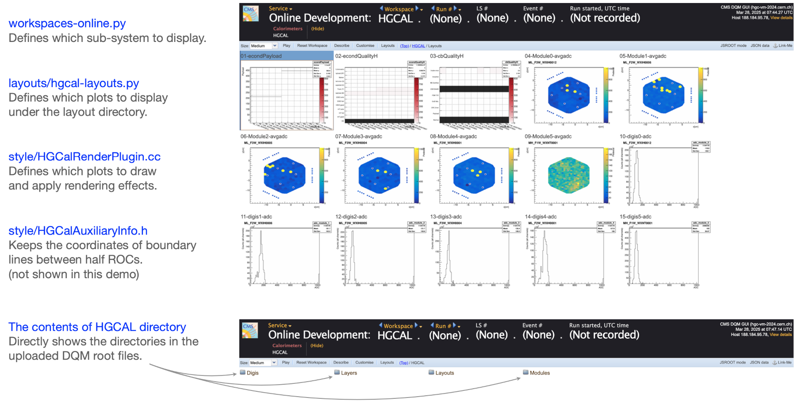

# HGCAL DQM GUI Layout and Plugins

This repository tracks CMS DQM GUI layouts and rendering plugins for HGCAL system tests.
To integrate into the official CMS DQM GUI for monitoring at the CMS control room (Point 5), create a pull request at:
https://github.com/dmwm/deployment

Below is an overview of the HGCAL DQM GUI interface, showing how these files in this repository control various aspects of the visualization:



## Build a CMS DQM GUI on OpenStack Virtual Machine
Please follow the official dqmgui deployment wiki here:

https://github.com/cms-DQM/dqmgui_prod_deployment/wiki/Deployment-on-OpenStack

## Customize the DQM GUI for HGCAL Layout

Commands to customize the CMS DQM GUI for HGCAL layout:
```
git clone https://github.com/CMS-HGCAL/hgc-dqmgui.git
cd hgc-dqmgui/
./quick_replacement.sh
/data/srv/current/config/dqmgui/manage -f online start "I did read documentation"
```

## Upload Files to the GUI

Commands to upload a file to the built GUI:
```
scp /afs/cern.ch/user/y/ykao/work/public/dqm_gui_related/DQM_V0001_HGCAL_R000123456.root root@{YOUR_VM}:~/
ssh root@{YOUR_VM}
source /data/srv/current/apps/dqmgui/128/etc/profile.d/env.sh
visDQMUpload http://{YOUR_VM}.cern.ch:8070/dqm/online-dev DQM_V0001_HGCAL_R000123456.root
```

Alternatively, if you're in a CMSSW environment on lxplus, you can use:
```
cmsenv
visDQMUpload http://{YOUR_VM}.cern.ch:8070/dqm/online-dev DQM_V0001_HGCAL_R000123456.root
```
